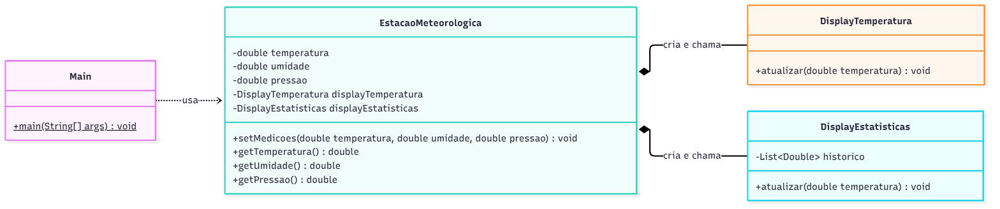
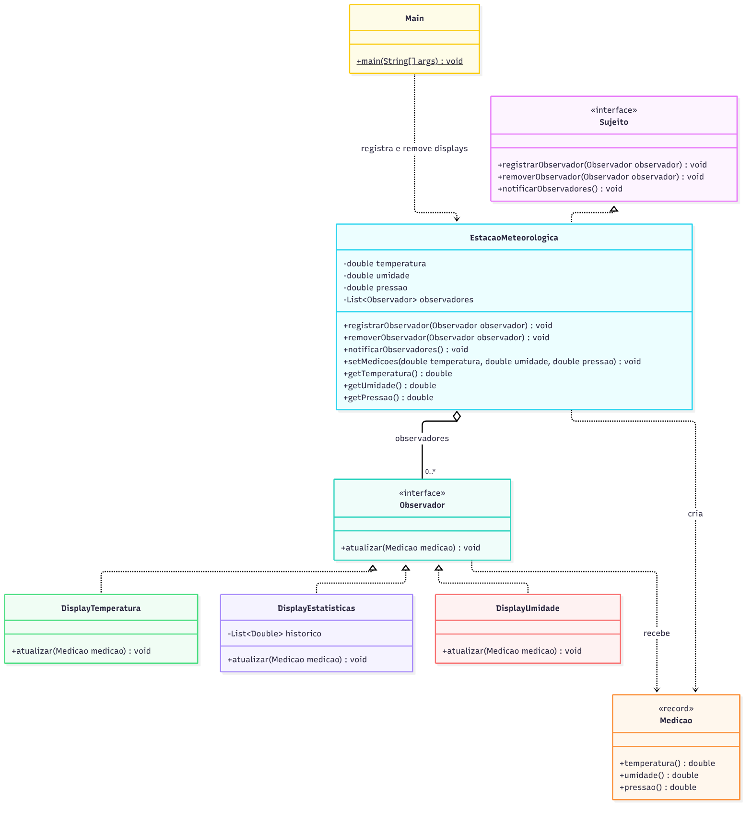

# Atividade: Observer

Aluno: Gabriel Maciel Zavarize

O que tem neste repositório:

- `projeto_observer_antipattern.zip`: o projeto original, do jeito que foi baixado.
- `projeto-observer/`: o projeto refatorado com o padrão Observer (Maven, Java 17).
- `diagramas/`: diagramas de classe de antes e depois da refatoração (PNG e o fonte em Mermaid).

Para rodar o projeto refatorado:

```bash
cd projeto-observer
mvn compile
java -cp target/classes br.venson.net.designpatterns.observer.Main
```

No Eclipse/IntelliJ é só importar a pasta `projeto-observer` e executar a classe `Main`.

## Exercício 1: Aplicações

**1. Estação meteorológica publicando medições para vários displays**

Faz sentido usar Observer. É o caso típico de notificação um para muitos: a estação muda de estado e vários displays precisam reagir. Com o padrão, a estação só conhece a interface de observador e não cada display, então dá para colocar ou tirar displays sem mexer nela.

**2. Interface gráfica com vários listeners e modelo avisando as views**

Faz sentido usar Observer. Os listeners de botão no Swing/JavaFX e o modelo avisando as views no MVC são o próprio Observer aplicado. O botão e o modelo não precisam saber quem está ouvindo, então um interessado novo entra só se registrando, sem alterar o modelo.

**3. Newsletter com assinantes que entram e saem a qualquer momento**

Faz sentido usar Observer. O número de assinantes varia e cada um pode assinar ou cancelar quando quiser, o que corresponde exatamente ao registrar e remover do sujeito. A newsletter só percorre a lista atual e entrega o conteúdo, sem precisar conhecer quem são os assinantes.

**4. `Configuracao` lida uma única vez por um único consumidor fixo**

Não faz sentido usar Observer. Os valores são lidos uma vez, por um consumidor só, sempre de forma direta, e não existe nenhuma mudança para ser avisada. Uma chamada direta resolve; colocar interface, lista de observadores e registro aqui seria complexidade sem ganho nenhum.

**5. Classe `Ponto` com `x` e `y`**

Não faz sentido usar Observer. O `Ponto` só guarda coordenadas e nunca avisa ninguém sobre mudanças, então não existe ninguém para notificar. Aplicar o padrão seria overengineering; se um dia aparecer alguém que precise reagir quando o ponto muda, aí vale reavaliar.

## Exercício 2: Rastreando o anti-pattern

Rodando o projeto original a saída é:

```
Temperatura atual: 25.0C
Media das temperaturas: 25.0C
Temperatura atual: 27.0C
Media das temperaturas: 26.0C
```

O resultado está certo, mas quem decide quais displays existem é a própria estação.

### 1. Por que a estação está fortemente acoplada aos displays?

A `EstacaoMeteorologica` cria os displays dentro dela (`new DisplayTemperatura()` e `new DisplayEstatisticas()`), guarda os tipos concretos como atributos e chama o `atualizar(double)` de cada um, sabendo inclusive que os dois só querem a temperatura. Ou seja, o sujeito depende diretamente dos observadores, quando o certo seria o contrário.

Na prática isso quer dizer que qualquer mudança em um display (a assinatura do método, o construtor, um display a mais ou a menos) obriga a abrir e recompilar a estação. Também não dá para usar a estação sem esses dois displays nem testar ela isolada, porque eles vêm junto sempre. A classe depende de implementações concretas em vez de uma abstração e, para ser estendida, precisa ser modificada.

### 2. O que muda na estação para adicionar um `DisplayUmidade`?

1. Criar a classe `DisplayUmidade` com um método `atualizar(double umidade)`.
2. Na `EstacaoMeteorologica`, adicionar o atributo `private final DisplayUmidade displayUmidade = new DisplayUmidade();`.
3. No `setMedicoes`, acrescentar a chamada `displayUmidade.atualizar(umidade);`.
4. Recompilar a estação. A partir daí todo código que usa a estação passa a ter o display de umidade, querendo ou não.

Cada display novo obriga a editar a classe do sujeito em dois pontos (atributo e `setMedicoes`), e o `Main` não tem nenhum controle sobre quais displays estão ligados.

### 3. Por que não dá para registrar ou remover display em tempo de execução?

Porque os displays são atributos `private final` inicializados na própria declaração, e as chamadas estão escritas diretamente no `setMedicoes`. Não existe lista, não existe método para adicionar ou tirar, e como os displays não têm um tipo em comum a estação nem teria como tratar todos da mesma forma. O conjunto de displays é decidido na hora da compilação.

Para permitir isso faltaria:

- uma interface comum (`Observador`) com o método `atualizar(...)`;
- uma coleção de observadores dentro da estação (`List<Observador>`);
- métodos para registrar e remover observadores;
- um método que percorra essa lista e avise todos quando as medições mudarem;
- tirar da estação a responsabilidade de criar os displays, deixando isso para quem monta o painel (aqui, o `Main`).

### 4. Refatoração com Observer

**Diagrama de classes: antes**



**Diagrama de classes: depois**



O código refatorado está em [`projeto-observer/src/main/java/br/venson/net/designpatterns/observer`](projeto-observer/src/main/java/br/venson/net/designpatterns/observer):

| Classe | Papel no padrão |
|---|---|
| [`Observador`](projeto-observer/src/main/java/br/venson/net/designpatterns/observer/Observador.java) | interface de observador, com `atualizar(Medicao)` |
| [`Sujeito`](projeto-observer/src/main/java/br/venson/net/designpatterns/observer/Sujeito.java) | interface do sujeito: registra, remove e notifica |
| [`EstacaoMeteorologica`](projeto-observer/src/main/java/br/venson/net/designpatterns/observer/EstacaoMeteorologica.java) | sujeito concreto |
| [`DisplayTemperatura`](projeto-observer/src/main/java/br/venson/net/designpatterns/observer/DisplayTemperatura.java) | observador concreto |
| [`DisplayEstatisticas`](projeto-observer/src/main/java/br/venson/net/designpatterns/observer/DisplayEstatisticas.java) | observador concreto |
| [`DisplayUmidade`](projeto-observer/src/main/java/br/venson/net/designpatterns/observer/DisplayUmidade.java) | observador novo, criado sem mexer na estação |
| [`Medicao`](projeto-observer/src/main/java/br/venson/net/designpatterns/observer/Medicao.java) | dados enviados em cada notificação |
| [`Main`](projeto-observer/src/main/java/br/venson/net/designpatterns/observer/Main.java) | monta o painel e registra os displays |

As duas interfaces ficaram assim:

```java
public interface Observador {

    void atualizar(Medicao medicao);
}

public interface Sujeito {

    void registrarObservador(Observador observador);

    void removerObservador(Observador observador);

    void notificarObservadores();
}
```

E o `setMedicoes` da estação não cita mais nenhum display:

```java
public void setMedicoes(double temperatura, double umidade, double pressao) {
    this.temperatura = temperatura;
    this.umidade = umidade;
    this.pressao = pressao;

    // A estacao nao sabe mais quem esta ouvindo, so avisa a lista.
    notificarObservadores();
}
```

Saída do `Main` refatorado:

```
-- medicao 1
Temperatura atual: 25.0C
Media das temperaturas: 25.0C
-- medicao 2
Temperatura atual: 27.0C
Media das temperaturas: 26.0C
Umidade relativa: 55.0%
-- medicao 3
Media das temperaturas: 28.0C
Umidade relativa: 40.0%
ALERTA: calor acima de 30C
```

Na medição 2 o display de umidade já aparece porque foi registrado no meio da execução, e na medição 3 a temperatura atual some porque aquele display foi removido.

#### Justificativa das decisões de design

**`Observador` com `atualizar(Medicao)`.** Optei pelo modelo push, em que a estação manda os dados junto com o aviso. No modelo pull o display receberia a própria estação e chamaria os getters, o que faria cada display depender de novo da `EstacaoMeteorologica` concreta, que é justamente o acoplamento que eu queria tirar. Por ter um método só, a interface também aceita lambda, o que é útil para observadores simples como o alerta de calor do `Main`.

**`Medicao` como record.** Em vez de `atualizar(double temperatura, double umidade, double pressao)`, os dados vão agrupados em um `record`. Isso evita trocar a ordem de três `double` sem perceber e, se um dia entrar uma medida nova (vento, por exemplo), a assinatura do `atualizar` continua a mesma e nenhum display precisa ser alterado. Como o record é imutável, um display também não consegue alterar o dado que os próximos vão receber.

**`Sujeito` como interface separada.** O contrato de registrar, remover e notificar fica separado da estação. Qualquer outra fonte de dados (um sensor de qualidade do ar, por exemplo) pode implementar o mesmo contrato, e quem só precisa registrar displays pode depender de `Sujeito` sem conhecer o resto da estação.

**`EstacaoMeteorologica` com uma `List<Observador>`.** A estação não cria mais nenhum display, só guarda a lista do que foi registrado. O `registrarObservador` ignora um observador que já esteja na lista, para o mesmo display não ser avisado duas vezes. O `notificarObservadores` percorre uma cópia da lista, assim um observador que resolva se remover durante o aviso não quebra o laço com `ConcurrentModificationException`. Mantive o `setMedicoes` e os getters com a mesma assinatura do original para que o código que já usava a estação continuasse funcionando.

**Displays implementando `Observador`.** A lógica de `DisplayTemperatura` e `DisplayEstatisticas` ficou igual à original, só mudou a assinatura para receber a `Medicao`. Cada display pega da medição o que interessa a ele, então a estação não precisa mais saber que um quer temperatura e outro quer umidade. A montagem do painel saiu da estação e foi para o `Main`.

### 5. Como fica adicionar um display e reutilizar a estação?

Adicionar um display agora é criar uma classe que implementa `Observador` e registrar ela. A estação não é aberta. O `DisplayUmidade` deste projeto foi feito exatamente assim:

```java
estacao.registrarObservador(new DisplayUmidade());
```

Para algo bem simples nem é preciso criar classe, um lambda já serve, como o alerta de calor do `Main`.

Quanto ao reuso: a estação só conhece a interface `Observador`, e quem escolhe os displays é quem monta o painel. Outro painel pode registrar um conjunto completamente diferente de displays usando a mesma `EstacaoMeteorologica` já compilada; daria até para empacotar a estação em um `.jar` e o outro painel só depender dele. E como o registro é feito em tempo de execução, o painel pode inclusive ligar e desligar displays enquanto o programa roda, como acontece no `Main` com o `removerObservador(temperatura)`.
